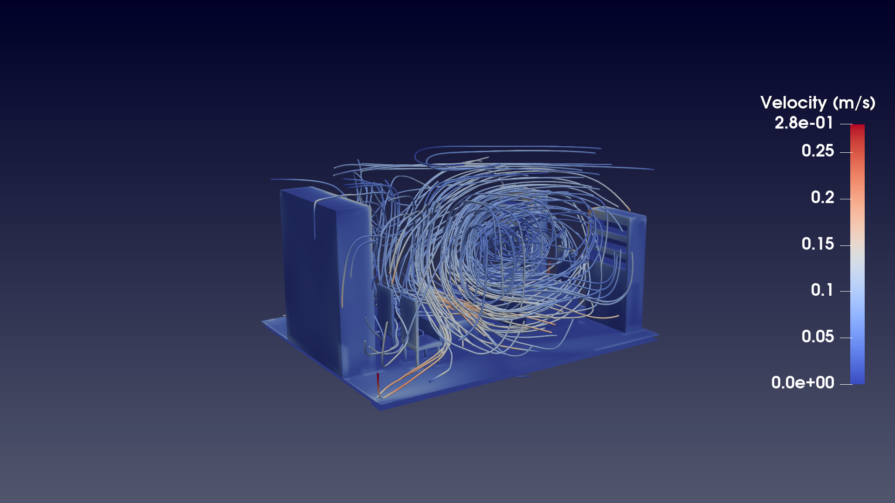
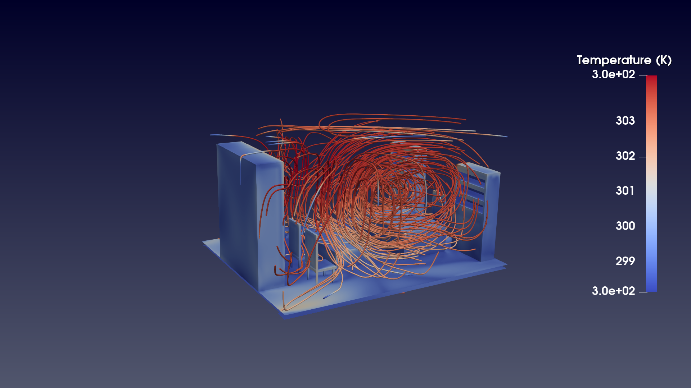
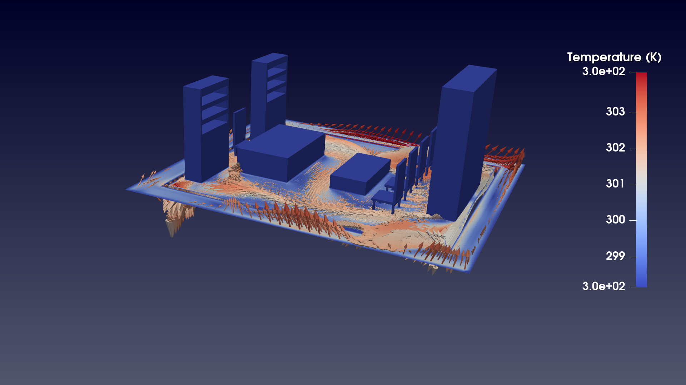
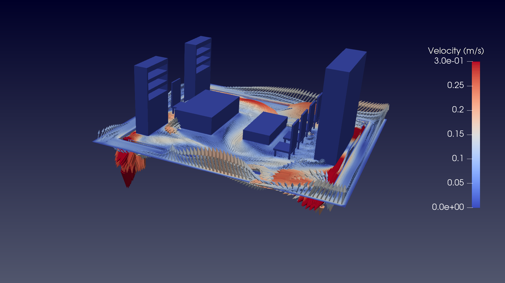

# 3D Indoor Airflow & Thermal Comfort Analysis using OpenFOAM

## 📌 Project Overview
This project presents a high-fidelity CFD simulation of indoor airflow and heat distribution within a furnished room.
---
---

## 📊 Visual Analysis & Results

### 1. Global Airflow Pathlines (Top View)

### 2. 3D Velocity Vortex Structure

### 3. Advanced Flow Vortex Analysis

### 4. Thermal & Vector Field Analysis

### 5. Velocity Magnitude Distribution

---
## 🛠 Technical Workflow & Numerical Specs

| Parameter | Specification |
| :--- | :--- |
| **Solver** | `buoyantSimpleFoam` (Steady-State / Buoyant) |
| **Turbulence Model** | RAS `k-Epsilon` |
| **Total Cells** | **741,946** |
| **Max Non-Orthogonality** | 37.42 |
| **Global Continuity Error** | **-2.78e-19** (Excellent Stability) |
| **Execution Time** | 6769.6 s |

### 📈 Convergence Performance (Final Residuals)
The simulation reached a high degree of convergence at iteration 1000:
- **Velocity (Ux, Uy, Uz):** ~4.1e-03
- **Pressure (p_rgh):** 4.6e-03
- **Enthalpy (h):** 2.9e-03
- **Turbulence (k, epsilon):** ~4.0e-03

### 🧩 Mesh Breakdown (checkMesh)
- **Hexahedra:** 674,032 cells
- **Polyhedra:** 67,914 cells
- **Mesh Status:** All geometry checks **OK**.

## 🚀 Key Findings
- **Zero Errors:** The mesh passed all topology and geometry checks with zero errors.
- **Ventilation Efficiency:** Strategic inlet positioning minimizes air stagnation.
- **Thermal Stability:** Captured stable temperature gradients from floor to ceiling.

**Developed by:** 
                Yashar raisi

